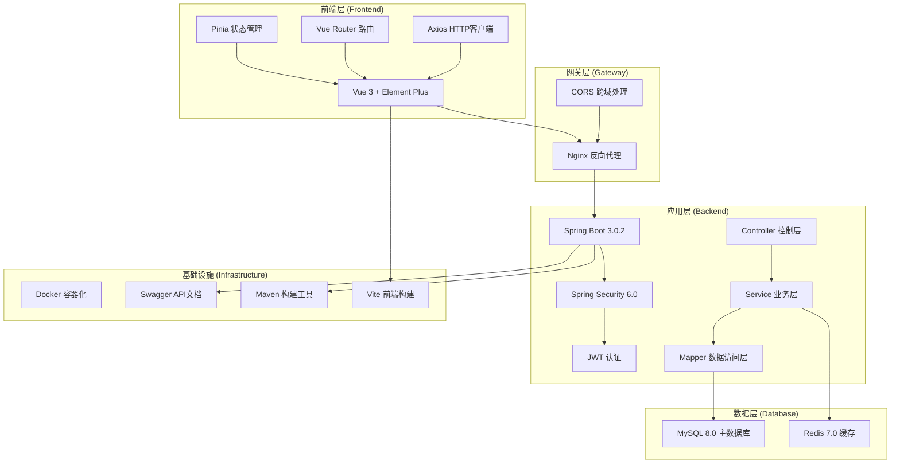
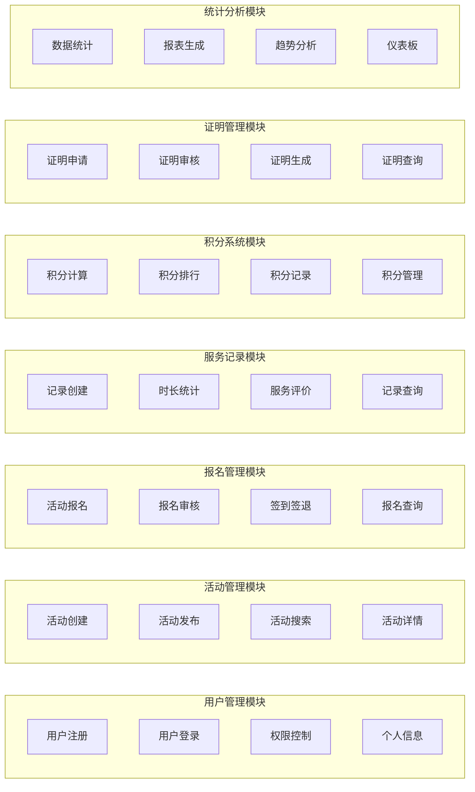
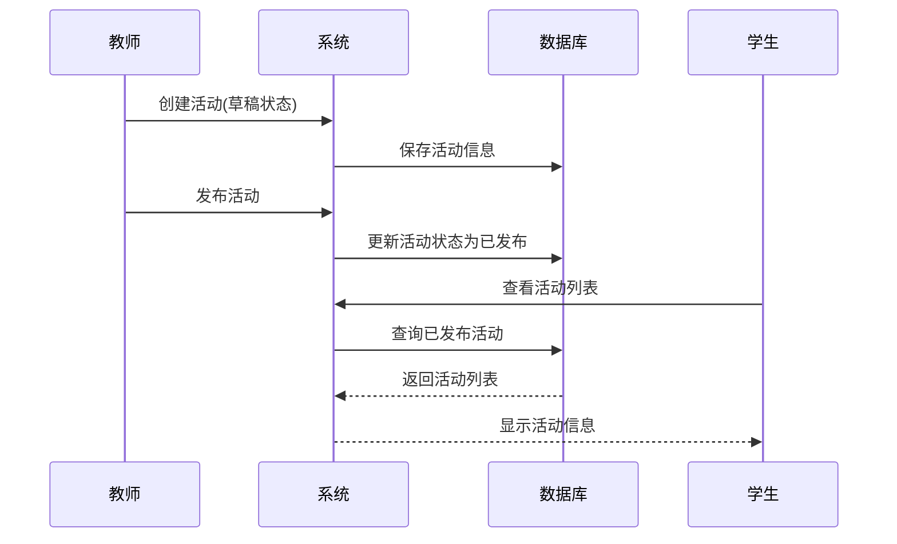
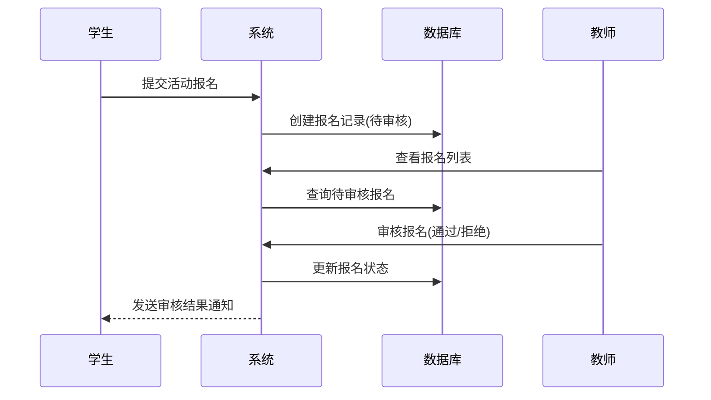
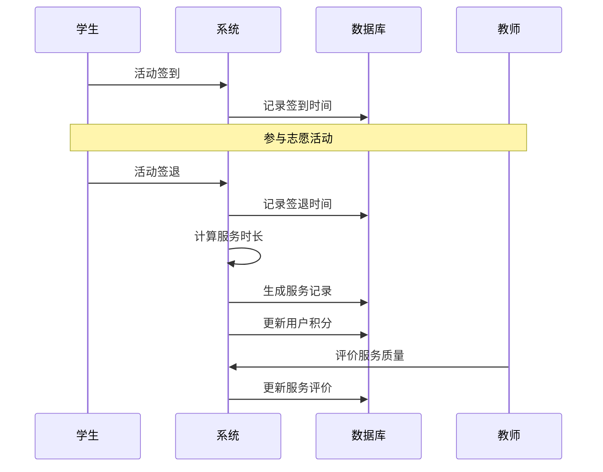

# CVS 高校志愿服务数字化系统 - 详细设计文档

## 📋 文档概述

本文档基于对 CVS (College Volunteer Service) 高校志愿服务数字化系统的全面代码分析，详细阐述了系统的架构设计、功能模块、技术实现和开发建议。该系统采用前后端分离架构，支持学生、教师、管理员三种角色的志愿服务管理需求。

---

## 1. 项目架构图和技术栈说明

### 1.1 系统架构图



### 1.2 技术栈详细说明

#### 前端技术栈
| 技术 | 版本 | 用途 | 特点 |
|------|------|------|------|
| Vue 3 | 3.5.18 | 前端框架 | Composition API、响应式系统 |
| Element Plus | 2.10.5 | UI组件库 | 丰富的组件、中文友好 |
| Pinia | 3.0.3 | 状态管理 | 轻量级、TypeScript友好 |
| Vue Router | 4.5.1 | 路由管理 | 支持嵌套路由、路由守卫 |
| Axios | 1.11.0 | HTTP客户端 | 请求拦截、响应处理 |
| Vite | 7.0.6 | 构建工具 | 快速热重载、ES模块支持 |

#### 后端技术栈
| 技术 | 版本 | 用途 | 特点 |
|------|------|------|------|
| Spring Boot | 3.0.2 | 应用框架 | 自动配置、内嵌服务器 |
| Spring Security | 6.0+ | 安全框架 | 认证授权、CSRF防护 |
| MyBatis-Plus | 3.5.3.1 | ORM框架 | 代码生成、分页插件 |
| JWT | 0.11.5 | 令牌认证 | 无状态认证、跨域支持 |
| MySQL | 8.0+ | 关系数据库 | ACID特性、高性能 |
| Redis | 7.0+ | 缓存数据库 | 高性能缓存、会话存储 |
| Swagger | 2.0.2 | API文档 | 自动生成、在线测试 |

---

## 2. 主要功能模块划分及交互流程

### 2.1 功能模块架构



### 2.2 核心业务流程

#### 2.2.1 活动管理流程


#### 2.2.2 报名审核流程


#### 2.2.3 服务记录生成流程


### 2.3 角色权限矩阵

| 功能模块 | 学生 | 教师 | 管理员 |
|----------|------|------|--------|
| 用户管理 | 查看个人信息 | 查看个人信息 | 全部用户管理 |
| 活动管理 | 查看活动列表 | 创建/编辑/删除活动 | 全部活动管理 |
| 报名管理 | 报名/取消报名 | 审核报名/签到管理 | 全部报名管理 |
| 服务记录 | 查看个人记录 | 查看相关记录 | 全部记录管理 |
| 积分系统 | 查看个人积分 | 查看学生积分 | 积分调整管理 |
| 证明管理 | 申请证明 | 审核证明 | 全部证明管理 |
| 统计分析 | 个人统计 | 相关统计 | 全局统计分析 |

---

## 3. 关键数据结构设计

### 3.1 数据库表结构

#### 3.1.1 用户表 (user_twb)
```sql
CREATE TABLE `user_twb` (
  `id` bigint NOT NULL AUTO_INCREMENT COMMENT '主键ID',
  `username` varchar(50) NOT NULL COMMENT '用户名（学号/工号）',
  `password` varchar(255) NOT NULL COMMENT '密码（加密）',
  `name` varchar(100) NOT NULL COMMENT '姓名',
  `role` varchar(20) NOT NULL COMMENT '角色（STUDENT/TEACHER/ADMIN）',
  `email` varchar(100) DEFAULT NULL COMMENT '邮箱',
  `phone` varchar(20) DEFAULT NULL COMMENT '手机号',
  `created_at` datetime NOT NULL DEFAULT CURRENT_TIMESTAMP,
  `updated_at` datetime NOT NULL DEFAULT CURRENT_TIMESTAMP ON UPDATE CURRENT_TIMESTAMP,
  `deleted` tinyint NOT NULL DEFAULT '0' COMMENT '逻辑删除标志',
  PRIMARY KEY (`id`),
  UNIQUE KEY `uk_username` (`username`)
);
```

#### 3.1.2 活动表 (activity_twb)
```sql
CREATE TABLE `activity_twb` (
  `id` bigint NOT NULL AUTO_INCREMENT COMMENT '主键ID',
  `title` varchar(200) NOT NULL COMMENT '活动标题',
  `description` text NOT NULL COMMENT '活动描述',
  `location` varchar(200) NOT NULL COMMENT '活动地点',
  `start_time` datetime NOT NULL COMMENT '开始时间',
  `end_time` datetime NOT NULL COMMENT '结束时间',
  `registration_deadline` datetime DEFAULT NULL COMMENT '报名截止时间',
  `max_participants` int NOT NULL COMMENT '最大参与人数',
  `status` varchar(20) NOT NULL DEFAULT 'DRAFT' COMMENT '活动状态',
  `organizer_id` bigint NOT NULL COMMENT '组织者ID',
  `requirements` text COMMENT '参与要求',
  `contact_info` varchar(200) COMMENT '联系方式',
  `points` int NOT NULL DEFAULT '0' COMMENT '奖励积分',
  `created_at` datetime NOT NULL DEFAULT CURRENT_TIMESTAMP,
  `updated_at` datetime NOT NULL DEFAULT CURRENT_TIMESTAMP ON UPDATE CURRENT_TIMESTAMP,
  `deleted` tinyint NOT NULL DEFAULT '0',
  PRIMARY KEY (`id`),
  KEY `idx_organizer_id` (`organizer_id`),
  KEY `idx_status` (`status`)
);
```

#### 3.1.3 报名表 (signup_twb)
```sql
CREATE TABLE `signup_twb` (
  `id` bigint NOT NULL AUTO_INCREMENT COMMENT '主键ID',
  `activity_id` bigint NOT NULL COMMENT '活动ID',
  `user_id` bigint NOT NULL COMMENT '用户ID',
  `status` varchar(20) NOT NULL DEFAULT 'PENDING' COMMENT '报名状态',
  `reason` text COMMENT '报名理由',
  `reject_reason` text COMMENT '拒绝原因',
  `signed_in` tinyint NOT NULL DEFAULT '0' COMMENT '是否签到',
  `signed_out` tinyint NOT NULL DEFAULT '0' COMMENT '是否签退',
  `sign_in_time` datetime DEFAULT NULL COMMENT '签到时间',
  `sign_out_time` datetime DEFAULT NULL COMMENT '签退时间',
  `created_at` datetime NOT NULL DEFAULT CURRENT_TIMESTAMP,
  `updated_at` datetime NOT NULL DEFAULT CURRENT_TIMESTAMP ON UPDATE CURRENT_TIMESTAMP,
  PRIMARY KEY (`id`),
  UNIQUE KEY `uk_activity_user` (`activity_id`,`user_id`)
);
```

### 3.2 核心实体类设计

#### 3.2.1 用户实体 (User.java)
```java
@Data
@TableName("user_twb")
public class User {
    @TableId(type = IdType.AUTO)
    private Long id;
    private String username;        // 用户名（学号/工号）
    private String password;        // 加密密码
    private String name;           // 真实姓名
    private UserRole role;         // 用户角色枚举
    private String email;          // 邮箱
    private String phone;          // 手机号
    
    @TableField(fill = FieldFill.INSERT)
    private LocalDateTime createdAt;
    
    @TableField(fill = FieldFill.INSERT_UPDATE)
    private LocalDateTime updatedAt;
    
    @TableLogic
    private Integer deleted;       // 逻辑删除标志
}
```

#### 3.2.2 活动实体 (Activity.java)
```java
@Data
@TableName("activity_twb")
public class Activity {
    @TableId(type = IdType.AUTO)
    private Long id;
    private String title;                    // 活动标题
    private String description;              // 活动描述
    private String location;                 // 活动地点
    private LocalDateTime startTime;         // 开始时间
    private LocalDateTime endTime;           // 结束时间
    private LocalDateTime registrationDeadline; // 报名截止时间
    private Integer maxParticipants;         // 最大参与人数
    private ActivityStatus status;           // 活动状态枚举
    private Long organizerId;                // 组织者ID
    private String requirements;             // 参与要求
    private String contactInfo;              // 联系方式
    private Integer points;                  // 奖励积分
    
    @TableField(fill = FieldFill.INSERT)
    private LocalDateTime createdAt;
    
    @TableField(fill = FieldFill.INSERT_UPDATE)
    private LocalDateTime updatedAt;
    
    @TableLogic
    private Integer deleted;
}
```

### 3.3 枚举类型定义

#### 3.3.1 用户角色枚举
```java
@Getter
@AllArgsConstructor
public enum UserRole {
    STUDENT("STUDENT", "学生"),
    TEACHER("TEACHER", "教师"),
    ADMIN("ADMIN", "管理员");
    
    private final String code;
    private final String description;
}
```

#### 3.3.2 活动状态枚举
```java
@Getter
@AllArgsConstructor
public enum ActivityStatus {
    DRAFT("DRAFT", "草稿"),
    PUBLISHED("PUBLISHED", "已发布"),
    ONGOING("ONGOING", "进行中"),
    COMPLETED("COMPLETED", "已完成"),
    CANCELLED("CANCELLED", "已取消");
    
    private final String code;
    private final String description;
}
```

#### 3.3.3 报名状态枚举
```java
@Getter
@AllArgsConstructor
public enum SignupStatus {
    PENDING("PENDING", "待审核"),
    APPROVED("APPROVED", "已通过"),
    REJECTED("REJECTED", "已拒绝");
    
    private final String code;
    private final String description;
}
```

---

## 4. 接口定义规范

### 4.1 RESTful API 设计规范

#### 4.1.1 URL 命名规范
- 基础路径：`/api`
- 资源命名：使用复数形式，如 `/activities`、`/users`
- 路径参数：使用 `{id}` 表示资源标识符
- 查询参数：用于过滤、排序、分页

#### 4.1.2 HTTP 方法使用规范
| 方法 | 用途 | 示例 |
|------|------|------|
| GET | 获取资源 | `GET /api/activities/{id}` |
| POST | 创建资源/复杂查询 | `POST /api/activities` |
| PUT | 更新资源 | `PUT /api/activities` |
| DELETE | 删除资源 | `DELETE /api/activities/{id}` |

### 4.2 统一响应格式

#### 4.2.1 成功响应格式
```json
{
  "code": 200,
  "message": "操作成功",
  "data": {
    // 具体数据内容
  },
  "timestamp": "2025-01-01T12:00:00"
}
```

#### 4.2.2 错误响应格式
```json
{
  "code": 400,
  "message": "请求参数错误",
  "data": null,
  "timestamp": "2025-01-01T12:00:00"
}
```

#### 4.2.3 分页响应格式
```json
{
  "code": 200,
  "message": "查询成功",
  "data": {
    "records": [
      // 数据列表
    ],
    "total": 100,
    "current": 1,
    "size": 10,
    "pages": 10
  }
}
```

### 4.3 核心接口定义

#### 4.3.1 用户认证接口
```java
@RestController
@RequestMapping("/api/auth")
public class AuthController {
    
    @PostMapping("/login")
    public Result<LoginVO> login(@Valid @RequestBody LoginDTO dto);
    
    @PostMapping("/register")
    public Result<Void> register(@Valid @RequestBody RegisterDTO dto);
    
    @PostMapping("/logout")
    public Result<Void> logout();
    
    @PostMapping("/send-code")
    public Result<Void> sendVerificationCode(@Valid @RequestBody SendCodeDTO dto);
}
```

#### 4.3.2 活动管理接口
```java
@RestController
@RequestMapping("/api/activities")
public class ActivityController {
    
    @PostMapping
    @PreAuthorize("hasAnyRole('TEACHER', 'ADMIN')")
    public Result<ActivityVO> createActivity(@Valid @RequestBody ActivityCreateDTO dto);
    
    @GetMapping("/{id}")
    public Result<ActivityVO> getActivityById(@PathVariable Long id);
    
    @PostMapping("/search")
    public Result<PageVO<ActivityVO>> getActivityList(@Valid @RequestBody PageDTO<ActivitySearchDTO> pageRequest);
    
    @PostMapping("/{id}/publish")
    @PreAuthorize("hasAnyRole('TEACHER', 'ADMIN')")
    public Result<Void> publishActivity(@PathVariable Long id);
}
```

#### 4.3.3 报名管理接口
```java
@RestController
@RequestMapping("/api/signups")
public class SignupController {
    
    @PostMapping
    @PreAuthorize("hasRole('STUDENT')")
    public Result<SignupVO> createSignup(@Valid @RequestBody SignupCreateDTO dto);
    
    @PostMapping("/approval")
    @PreAuthorize("hasAnyRole('TEACHER', 'ADMIN')")
    public Result<Void> approveSignup(@Valid @RequestBody SignupApprovalDTO dto);
    
    @PostMapping("/sign-in-out")
    public Result<Void> signInOut(@Valid @RequestBody SignInOutDTO dto);
}
```

### 4.4 数据传输对象 (DTO) 设计

#### 4.4.1 请求 DTO 示例
```java
@Data
public class ActivityCreateDTO {
    @NotBlank(message = "活动标题不能为空")
    @Size(max = 200, message = "活动标题长度不能超过200字符")
    private String title;
    
    @NotBlank(message = "活动描述不能为空")
    private String description;
    
    @NotBlank(message = "活动地点不能为空")
    private String location;
    
    @NotNull(message = "开始时间不能为空")
    @Future(message = "开始时间必须是未来时间")
    private LocalDateTime startTime;
    
    @NotNull(message = "结束时间不能为空")
    private LocalDateTime endTime;
    
    private LocalDateTime registrationDeadline;
    
    @NotNull(message = "最大参与人数不能为空")
    @Min(value = 1, message = "最大参与人数至少为1")
    private Integer maxParticipants;
    
    private String requirements;
    private String contactInfo;
    
    @Min(value = 0, message = "奖励积分不能为负数")
    private Integer points = 0;
}
```

#### 4.4.2 响应 VO 示例
```java
@Data
public class ActivityVO {
    private Long id;
    private String title;
    private String description;
    private String location;
    private LocalDateTime startTime;
    private LocalDateTime endTime;
    private LocalDateTime registrationDeadline;
    private Integer maxParticipants;
    private Integer currentParticipants;  // 当前报名人数
    private ActivityStatus status;
    private Long organizerId;
    private String organizerName;         // 组织者姓名
    private String requirements;
    private String contactInfo;
    private Integer points;
    private LocalDateTime createdAt;
    private LocalDateTime updatedAt;
}
```

---

## 5. 安全设计

### 5.1 认证授权机制

#### 5.1.1 JWT 令牌认证
```java
@Component
public class JwtUtil {
    private String secret = "your-secret-key";
    private long expiration = 86400000; // 24小时
    
    public String generateToken(UserPrincipal userPrincipal) {
        return Jwts.builder()
            .setSubject(userPrincipal.getUsername())
            .claim("userId", userPrincipal.getUserId())
            .claim("role", userPrincipal.getRole())
            .setIssuedAt(new Date())
            .setExpiration(new Date(System.currentTimeMillis() + expiration))
            .signWith(SignatureAlgorithm.HS512, secret)
            .compact();
    }
}
```

#### 5.1.2 Spring Security 配置
```java
@Configuration
@EnableWebSecurity
@EnableMethodSecurity(prePostEnabled = true)
public class SecurityConfig {
    
    @Bean
    public SecurityFilterChain filterChain(HttpSecurity http) throws Exception {
        http.csrf(csrf -> csrf.disable())
            .sessionManagement(session -> session.sessionCreationPolicy(SessionCreationPolicy.STATELESS))
            .authorizeHttpRequests(auth -> auth
                .requestMatchers("/api/auth/**").permitAll()
                .requestMatchers("/swagger-ui/**", "/v3/api-docs/**").permitAll()
                .anyRequest().authenticated()
            )
            .addFilterBefore(jwtAuthenticationFilter, UsernamePasswordAuthenticationFilter.class);
        
        return http.build();
    }
}
```

### 5.2 数据安全

#### 5.2.1 密码加密
```java
@Service
public class PasswordUtil {
    private final BCryptPasswordEncoder passwordEncoder = new BCryptPasswordEncoder();
    
    public String encode(String rawPassword) {
        return passwordEncoder.encode(rawPassword);
    }
    
    public boolean matches(String rawPassword, String encodedPassword) {
        return passwordEncoder.matches(rawPassword, encodedPassword);
    }
}
```

#### 5.2.2 SQL 注入防护
- 使用 MyBatis-Plus 的参数化查询
- 输入参数验证和过滤
- 最小权限原则的数据库用户

### 5.3 接口安全

#### 5.3.1 CORS 配置
```java
@Configuration
public class CorsConfig {
    
    @Bean
    public CorsConfigurationSource corsConfigurationSource() {
        CorsConfiguration configuration = new CorsConfiguration();
        configuration.setAllowedOriginPatterns(Arrays.asList("*"));
        configuration.setAllowedMethods(Arrays.asList("GET", "POST", "PUT", "DELETE", "OPTIONS"));
        configuration.setAllowedHeaders(Arrays.asList("*"));
        configuration.setAllowCredentials(true);
        
        UrlBasedCorsConfigurationSource source = new UrlBasedCorsConfigurationSource();
        source.registerCorsConfiguration("/**", configuration);
        return source;
    }
}
```

#### 5.3.2 参数验证
```java
@RestController
@Validated
public class ActivityController {
    
    @PostMapping
    public Result<ActivityVO> createActivity(
            @Valid @RequestBody ActivityCreateDTO dto,
            @AuthenticationPrincipal UserPrincipal principal) {
        // 业务逻辑处理
    }
}
```

---

## 6. 性能优化设计

### 6.1 数据库优化

#### 6.1.1 索引设计
```sql
-- 用户表索引
CREATE INDEX idx_user_role ON user_twb(role);
CREATE INDEX idx_user_created_at ON user_twb(created_at);

-- 活动表索引
CREATE INDEX idx_activity_organizer_id ON activity_twb(organizer_id);
CREATE INDEX idx_activity_status ON activity_twb(status);
CREATE INDEX idx_activity_start_time ON activity_twb(start_time);

-- 报名表索引
CREATE INDEX idx_signup_user_id ON signup_twb(user_id);
CREATE INDEX idx_signup_status ON signup_twb(status);
CREATE UNIQUE INDEX uk_activity_user ON signup_twb(activity_id, user_id);
```

#### 6.1.2 分页查询优化
```java
@Service
public class ActivityServiceImpl implements ActivityService {
    
    @Override
    public PageVO<ActivityVO> getActivityList(PageDTO<ActivitySearchDTO> pageRequest) {
        Page<Activity> page = PageUtil.toPage(pageRequest);
        
        // 构建查询条件
        LambdaQueryWrapper<Activity> wrapper = new LambdaQueryWrapper<>();
        // ... 条件构建
        
        // 执行分页查询
        IPage<Activity> result = activityMapper.selectPage(page, wrapper);
        
        // 批量查询关联数据，避免N+1问题
        enrichActivityVOList(pageVO.getRecords());
        
        return PageUtil.convert(result, ActivityVO.class);
    }
}
```

### 6.2 缓存策略

#### 6.2.1 Redis 缓存配置
```java
@Configuration
@EnableCaching
public class RedisConfig {
    
    @Bean
    public RedisTemplate<String, Object> redisTemplate(RedisConnectionFactory factory) {
        RedisTemplate<String, Object> template = new RedisTemplate<>();
        template.setConnectionFactory(factory);
        
        // 设置序列化器
        template.setKeySerializer(new StringRedisSerializer());
        template.setValueSerializer(new GenericJackson2JsonRedisSerializer());
        
        return template;
    }
}
```

#### 6.2.2 缓存使用示例
```java
@Service
public class ActivityServiceImpl implements ActivityService {
    
    @Cacheable(value = "activities", key = "#id")
    public ActivityVO getActivityById(Long id) {
        // 查询数据库
        Activity activity = activityMapper.selectById(id);
        return BeanUtil.to(activity, ActivityVO.class);
    }
    
    @CacheEvict(value = "activities", key = "#result.id")
    public ActivityVO updateActivity(ActivityUpdateDTO dto, Long organizerId) {
        // 更新逻辑
    }
}
```

### 6.3 前端性能优化

#### 6.3.1 路由懒加载
```javascript
const routes = [
  {
    path: '/admin/dashboard',
    name: 'adminDashboard',
    component: () => import('@/views/admin/Dashboard.vue'),
    meta: { title: '管理员仪表板' }
  }
];
```

#### 6.3.2 组件缓存
```vue
<template>
  <keep-alive :include="cachedViews">
    <router-view />
  </keep-alive>
</template>
```

---

## 7. 后续开发建议

### 7.1 功能扩展建议

#### 7.1.1 短期优化 (1-3个月)
1. **消息通知系统**
   - 邮件通知：活动发布、报名审核结果
   - 站内消息：实时通知推送
   - 微信小程序：移动端支持

2. **文件管理功能**
   - 活动图片上传
   - 证明文件生成和下载
   - 用户头像管理

3. **数据导出功能**
   - Excel 报表导出
   - 服务记录统计
   - 积分排行榜导出

#### 7.1.2 中期扩展 (3-6个月)
1. **移动端适配**
   - 响应式设计优化
   - PWA 支持
   - 微信小程序开发

2. **高级统计分析**
   - 数据可视化图表
   - 趋势分析报告
   - 用户行为分析

3. **系统集成**
   - 学校教务系统对接
   - 第三方支付集成
   - 社交媒体分享

#### 7.1.3 长期规划 (6个月以上)
1. **智能化功能**
   - AI 推荐算法
   - 智能匹配系统
   - 自动化审核

2. **多租户支持**
   - 多学校部署
   - 数据隔离
   - 个性化配置

3. **微服务架构**
   - 服务拆分
   - 分布式部署
   - 容器化编排

### 7.2 技术债务处理

#### 7.2.1 代码质量提升
1. **单元测试覆盖**
   ```java
   @SpringBootTest
   class ActivityServiceTest {
       
       @Test
       void testCreateActivity() {
           // 测试活动创建逻辑
       }
   }
   ```

2. **代码规范检查**
   - ESLint 配置优化
   - SonarQube 代码质量检查
   - 代码审查流程

3. **文档完善**
   - API 文档更新
   - 开发者指南
   - 部署文档

#### 7.2.2 性能监控
1. **应用监控**
   - Spring Boot Actuator
   - Micrometer 指标收集
   - Prometheus + Grafana

2. **日志管理**
   - 结构化日志
   - 日志聚合分析
   - 错误追踪

### 7.3 安全加固建议

#### 7.3.1 安全审计
1. **漏洞扫描**
   - 依赖库安全检查
   - 代码安全审计
   - 渗透测试

2. **访问控制**
   - 细粒度权限控制
   - 操作日志记录
   - 异常行为监控

#### 7.3.2 数据保护
1. **数据备份**
   - 定期数据备份
   - 灾难恢复计划
   - 数据加密存储

2. **隐私保护**
   - 个人信息脱敏
   - GDPR 合规性
   - 数据访问审计

### 7.4 运维部署建议

#### 7.4.1 CI/CD 流水线
```yaml
# .github/workflows/deploy.yml
name: Deploy to Production
on:
  push:
    branches: [main]
jobs:
  deploy:
    runs-on: ubuntu-latest
    steps:
      - uses: actions/checkout@v2
      - name: Build and Deploy
        run: |
          docker build -t cvs-app .
          docker push registry/cvs-app:latest
```

#### 7.4.2 容器化部署
```dockerfile
# Dockerfile
FROM openjdk:17-jdk-slim
COPY target/cvs-*.jar app.jar
EXPOSE 8080
ENTRYPOINT ["java", "-jar", "/app.jar"]
```

#### 7.4.3 监控告警
1. **系统监控**
   - CPU、内存、磁盘使用率
   - 数据库连接池状态
   - 应用响应时间

2. **业务监控**
   - 用户注册量
   - 活动发布数量
   - 系统错误率

---

## 8. 总结

CVS 高校志愿服务数字化系统采用现代化的技术栈和架构设计，具备以下特点：

### 8.1 技术优势
- **前后端分离**：Vue 3 + Spring Boot 3 的组合提供了良好的开发体验
- **安全可靠**：JWT 认证 + Spring Security 保障系统安全
- **高性能**：MyBatis-Plus + Redis 缓存提升系统性能
- **易维护**：清晰的分层架构和规范的代码结构

### 8.2 业务价值
- **角色明确**：支持学生、教师、管理员三种角色的差异化需求
- **流程完整**：覆盖活动管理、报名审核、服务记录、积分系统等完整业务流程
- **数据驱动**：提供丰富的统计分析功能，支持数据化决策

### 8.3 扩展性
- **模块化设计**：各功能模块相对独立，便于扩展和维护
- **标准化接口**：RESTful API 设计便于第三方系统集成
- **容器化部署**：Docker 支持便于横向扩展和云部署

### 8.4 最新更新 (v1.1)
- **前端优化**：Landing页面全屏轮播图设计，透明导航栏，滚动自适应样式
- **用户体验**：优化页面滚动吸附效果，改善视觉层次
- **代码质量**：移除调试日志，提升生产环境性能
- **版权更新**：所有版权信息更新至2025年

该系统为高校志愿服务管理提供了完整的数字化解决方案，具备良好的技术基础和扩展潜力，能够满足当前需求并支持未来的功能扩展。

---

**文档版本**: v1.1  
**最后更新**: 2025年10月  
**维护团队**: CVS Development Team